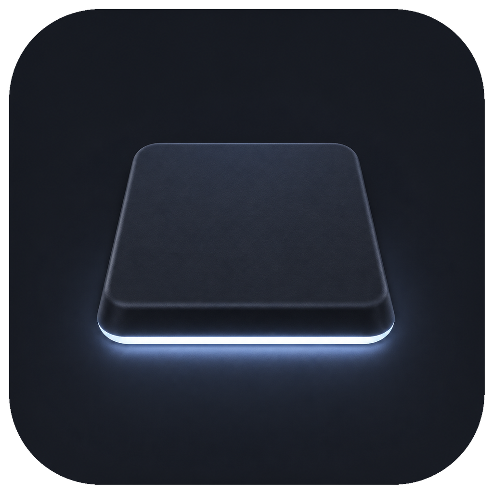

<div align="center">
  
  <h1>MagicKey</h1>
  <p>让 MacBook 内置键盘背光随呼吸、敲击与音乐流动。</p>
  <p>
    
    
    
    
    <a href="LICENSE"></a>
  </p>
</div>

MagicKey 是一款轻量的 macOS 菜单栏工具，为 MacBook 内置键盘背光提供常亮、呼吸、心跳、频闪、按键脉冲和音乐律动效果。亮度、速度、静息亮度与音乐灵敏度均可调节；应用停止或正常退出时会立即恢复接管前的状态，异常中断留下的状态则会在下次启动时恢复。

## 安装

> [!IMPORTANT]
> **发行包未经 Apple 公证，首次打开一定会被 Gatekeeper 拦下**——这不是包坏了，
> 需要手动放行一次。原因与三种放行方式见下方[「首次打开被拦下」](#首次打开被拦下)。
> 另外发行包是 arm64 单架构，**Intel 机型无法启动**。

### 下载发行包

从 [Releases](https://github.com/XiaoSong1223/MagicKey/releases/latest) 下载 `MagicKey-<版本>.zip`，解压后把 `MagicKey.app` 拖进 `/Applications`，然后按下一节放行一次。

### 首次打开被拦下

MagicKey 只做了本地 ad-hoc 签名，没有 Developer ID，也没有经过公证，因此 Gatekeeper 一律拒绝：

```console
$ codesign -dv MagicKey.app
Signature=adhoc          TeamIdentifier=not set

$ spctl -a -t exec -vvv MagicKey.app
MagicKey.app: rejected
```

从浏览器下载的压缩包还会被系统打上隔离属性（`com.apple.quarantine`），双击时提示“Apple 无法验证此 App 是否包含恶意软件”。三种放行方式，任选其一，都是**一次性**的：

**① 系统设置放行（不用终端）**

先双击一次 `MagicKey.app`，让系统记下这次拦截，然后打开**系统设置 → 隐私与安全性**，向下滚动到安全性一栏，点击“仍要打开”，再确认一次即可。

> [!NOTE]
> macOS 15 起，Apple 移除了“右键 → 打开”这条旧捷径。现在只剩系统设置这一条路径。

**② 命令行解除隔离属性**

```bash
xattr -dr com.apple.quarantine /Applications/MagicKey.app
```

**③ 从源码构建**

本地构建出来的应用不带隔离属性，完全不会遇到这道拦截。见下一节。

> [!NOTE]
> **“开机自动启动”依赖代码签名。** `SMAppService` 要求应用带有系统认可的签名，
> 而发行包只有本地 ad-hoc 签名，注册有可能被系统拒绝；被拒时界面会如实显示错误，
> 其余功能不受影响。发行包与 `make install` 的签名方式完全相同，两者行为一致。

### 从源码构建

需要 Xcode 26 或更高版本（SDK 26）：

```bash
xcode-select -p                          # 应指向 /Applications/Xcode.app/...
xcrun --sdk macosx --show-sdk-version    # 应为 26 或更高
git clone https://github.com/XiaoSong1223/MagicKey.git
cd MagicKey
make -C app install
```

> [!IMPORTANT]
> 界面的 Liquid Glass 外观由**构建时链接的 SDK 版本**决定，而非运行时的系统版本。
> 使用 Command Line Tools（SDK 15 及更早）构建出的二进制，即使运行在 macOS 26 上
> 也只会呈现旧版外观。`app/Makefile` 会自动检测 SDK 版本并选择对应的代码路径。

`make install` 会构建应用、进行本地 ad-hoc 签名、复制到 `/Applications`，然后启动 MagicKey。启动后点击菜单栏中的键帽图标即可设置效果。

卸载应用：

```bash
make -C app uninstall
```

卸载前请先在 MagicKey 中关闭“开机自动启动”。卸载命令只移除 `/Applications/MagicKey.app`，不会删除已有偏好设置。

> [!NOTE]
> 当前尚未提供 Homebrew cask。Developer ID 签名与公证也还没有做，那会一并去掉
> 上面那道拦截，并让发行包中的“开机自动启动”可用。

## 功能

### 六种背光效果

| 模式 | 表现 |
| --- | --- |
| 常亮 | 将整块键盘保持在指定亮度 |
| 呼吸 | 在最暗与最亮之间平滑往返 |
| 心跳 | 模拟一强一弱的双脉冲节奏 |
| 频闪 | 以可调周期快速明暗切换 |
| 按键 | 每次敲键时让整块键盘闪出一道脉冲 |
| 音乐 | 识别系统播放声音中的鼓点并驱动背光 |

### 键盘敲击音效

敲击内置键盘时播放真实机械键盘的录音。它与背光效果彼此独立，可以单独使用，也可以同时开启。

- 十二套音色，按听感从脆到轻排列：

  | | | |
  |---|---|---|
  | **清脆**（Box Navy） | **铿锵**（SKCM Blue Alps） | **老派**（IBM Buckling Spring） |
  | **厚实**（Holy Panda） | **绵密**（Topre 静电容） | **浑厚**（NovelKeys Cream） |
  | **深沉**（Gateron Ink Black） | **闷响**（Cherry MX Black） | **圆润**（Gateron Ink Red） |
  | **顺滑**（Turquoise Tealios） | **轻柔**（Cherry MX Brown） | **安静**（Alpaca） |

- 按下与抬起都有独立录音，空格、回车、退格另有专属采样，修饰键也会响
- 长按只响按下与抬起两声，不会跟着系统的按键重复变成连珠炮
- 每次播放在多条采样之间随机轮换，并叠加轻微的音量与音高抖动，连打不会听出机械感
- 十二套音色做过响度对齐，切换音色不会顺带改变音量
- 停止敲击约 30 秒后自动停用音频引擎，下次按键再拉起

#### 自定义按键音

除了内置音色，还可以给**单个按键**指定自己的采样。设置窗口 →「键盘音效」→「自定义按键音…」
打开一张 MacBook 键盘图，点哪个键就给哪个键选音。

- 支持常见音频格式（mp3 / m4a / wav / aiff），单条不超过 2 秒
- 导入时自动把响度对齐到与内置音色相同的目标，自己录的声音不会突然响一大截
- 导入的文件会被拷贝进 `~/Library/Application Support/MagicKey/CustomSounds/`，
  之后移动或删除原文件都不影响
- 只替换**按下**的那一声，抬起仍用音色包——两声都换成同一条采样的话，
  一次敲击会听到两遍一样的声音
- 左右 Shift / Option / Command 的键码不同，可以分别指音
- 有一个总开关，可随时关掉整层做 A/B，指键关系会保留

> [!NOTE]
> 触控 ID 不产生按键事件，所以键盘图上没有画它。
> F1–F12 若没有在系统设置中设为标准功能键，直接按下发出的是亮度/音量之类的系统事件，
> 不产生按键事件，指了也不会响。

> [!IMPORTANT]
> 这是 MagicKey 中**唯一**需要“输入监控”权限的功能，因此**默认关闭**，必须由你主动开启。
> 未授权时不会安装任何按键监听，也不会启动音频引擎。
> 在系统设置中勾选授权后，需要**退出并重新打开 MagicKey** 才会生效——这是该权限的固有行为，
> 不是设置没保存。此时面板会显示“已授权 · 退出并重新打开 MagicKey 后生效”，
> 旁边的“重新打开”按钮可一键完成；在重启生效之前，MagicKey 不会假装自己已经在工作。

开关和音量在菜单栏面板里，音色在设置窗口中选择。权限位置：

```text
系统设置 → 隐私与安全性 → 输入监控
```

### 自动化与状态保护

- 调节亮度、速度、最暗亮度、脉冲时长和音乐灵敏度
- 默认以 60fps 渲染，也可切换到 30fps 低帧率模式
- 睡眠、锁屏、息屏或切换用户时自动停止，恢复使用后自动继续
- 默认在 120 秒无输入且没有音频播放时暂停，避免后台持续刷新
- 支持登录时自动启动；签名或安装位置不符合系统要求时会在界面中显示错误
- 作为纯菜单栏应用运行，不占用 Dock 位置
- 接管前保存亮度、环境光自动调节和闲置调暗设置，停止时按正确顺序恢复
- 异常退出后在下次启动时检测残留快照并先行恢复

### 菜单栏状态

| 图标 | 状态 |
| --- | --- |
| 线框键帽 | MagicKey 已停止，或因锁屏、息屏、空闲而暂时停止 |
| 实心键帽 | 背光效果正在运行 |

图标使用 macOS Template 资源，会自动适配浅色、深色、选中与高对比度菜单栏。

## 系统要求

- macOS 14 或更高版本
- Apple Silicon MacBook。发行包是 arm64 单架构二进制，**Intel 机型无法启动**
- 带背光的内置键盘
- 音乐律动需要 macOS 14.2 或更高版本
- 界面外观面向 macOS 26 设计与实测。在 macOS 14–15 上功能完整，
  Liquid Glass 自动回退为系统标准外观，效果网格的选中态改用着色描边标示；
  这条回退路径尚未在真机上验证

MagicKey 面向 MacBook 内置键盘背光；外接键盘不在支持范围内。

## 硬件限制

> [!IMPORTANT]
> MagicKey 不能改变背光颜色，也不能单独控制某一枚按键。MacBook 内置键盘的全部 LED 共用一路全局亮度通道，因此所有效果都会作用于整块键盘。

这不是权限或驱动层面的限制。`root`、内核驱动或私有 API 都无法产生硬件不存在的 RGB 与逐键控制能力。更完整的实测结论、量化约束和设计取舍见 [DESIGN.md](DESIGN.md)。

## 权限与隐私

| 功能 | 权限或网络行为 | 数据处理方式 |
| --- | --- | --- |
| 常亮、呼吸、心跳、频闪 | 无额外权限 | 只写入键盘的全局亮度值 |
| 按键脉冲 | 不需要“输入监控” | 只读取全局按键事件计数与距最近事件的时间，不读取 keycode 或输入内容 |
| 音乐律动 | 需要“系统录音”，不是“麦克风” | 音频仅在内存中换算为低频能量与鼓点事件，随即丢弃 |
| 键盘敲击音效 | 需要“输入监控”，**默认关闭** | 只用 keycode 决定播哪一条采样（内置音色按空格/回车/退格/通用分类；自定义按键音按 keycode 逐键查表）；不读取字符内容，不记录、不保存、不上传任何按键内容。写入磁盘的只有你自己导入的音频文件和一张“哪个键指了哪条音色”的表 |
| 更新检查 | 启动时访问一次 GitHub Releases API，之后最多每 24 小时一次 | User-Agent 只包含应用名和版本，不发送设备标识或使用数据 |

MagicKey 不录音、不写入音频文件、不上传声音、不包含遥测，也不发送崩溃报告。关闭“自动检查更新”后不会再自动联网；用户主动点击“检查更新”时仍会访问 GitHub。

需要授权的两个功能，权限位置分别是：

```text
系统设置 → 隐私与安全性 → 系统录音     # 音乐律动
系统设置 → 隐私与安全性 → 输入监控     # 键盘敲击音效
```

“输入监控”授予的是**监听按键的能力**，这一点无法在技术上收窄。MagicKey 对该权限的使用范围有限：只取虚拟键码判断该播哪一条采样，不读取字符内容，不写入磁盘，不联网发送。不接受这个权限的用户可以让键盘敲击音效保持关闭，其余功能完全不受影响。

## 工作原理

MagicKey 通过运行时加载 `CoreBrightness.framework`，调用 `KeyboardBrightnessClient` 读写内置键盘的 0–255 全局亮度。应用不会静态链接私有框架，而是使用 `dlopen` 和 selector 探测；接口不可用时会在界面中显示“不受支持”，而不是崩溃。由于这是私有接口，未来的 macOS 更新仍可能改变其行为。

背光接管由 `StateGuard` 管理：启动效果前保存原始状态，运行期间暂停环境光自动调节与闲置调暗，停止时恢复原有设置。整个过程不需要 `root`。

由于使用了私有系统接口，MagicKey 不能通过 Mac App Store 分发。

## 常见问题

### 为什么按键脉冲不能从按下的键向外扩散？

硬件只暴露一个全局亮度值，系统没有逐键灯光通道。MagicKey 也不读取具体键值，因此按键脉冲只能让整块键盘一起变化。

### 为什么音乐模式需要“系统录音”权限？

音乐模式需要读取 Mac 当前正在播放的系统声音，才能检测低频能量和鼓点。它不使用麦克风，也不会保存或传输音频。

### 为什么低亮度时偶尔能看出档位？

键盘背光是 8 位控制量：`0...255`，共 256 个离散亮度值。60fps 已接近硬件量化下限；提高最暗亮度通常比继续提高帧率更有效。详细测量见 [DESIGN.md](DESIGN.md)。

### 为什么不发布到 Mac App Store？

App Store 不允许使用 MagicKey 所依赖的私有 `CoreBrightness` 接口。项目需要通过独立构建或未来的签名发行包分发。

## 从源码开发

项目不使用 SwiftPM；应用通过 `swiftc` 和 Makefile 手工组装 `.app` bundle，当前没有第三方运行时依赖。

```bash
make -C app          # Release 构建
make -C app debug    # 带调试信息的构建
make -C app run      # 在终端运行并查看日志
make -C app clean    # 清理产物
```

项目结构：

```text
Core/       驱动、状态托管、效果模型与音频/按键脉冲源
app/        SwiftUI 菜单栏应用、资源和手工构建脚本
tools/      效果曲线分析与能耗测试工具
DESIGN.md   架构、硬件实测与设计约束
```

测试与分析工具的使用方式见 [tools/README.md](tools/README.md) 与 [tools/TESTING.md](tools/TESTING.md)。

## Roadmap

- CLI 与 URL Scheme 触发
- Developer ID 签名、公证与稳定的发行包
- 在真实设备与更多 macOS 版本上持续验证私有接口兼容性

## 参与贡献

欢迎提交 [Issue](https://github.com/XiaoSong1223/MagicKey/issues) 或 Pull Request。涉及效果曲线、状态恢复或硬件行为的修改，请先阅读 [DESIGN.md](DESIGN.md) 中的实测约束。

## 第三方素材与致谢

键盘敲击音效使用的全部采样来自 **[kbsim](https://github.com/tplai/kbsim)**（Mechanical Keyboard Simulator，[kbs.im](https://kbs.im)），作者 **Thomas Lai**，以 **MIT License** 发布。

MagicKey 收录了其中十二套：`alpaca`、`blackink`、`bluealps`、`boxnavy`、`buckling`、`cream`、`holypanda`、`mxblack`、`mxbrown`、`redink`、`topre`、`turquoise`，文件逐字节未作修改，随应用分发于 `MagicKey.app/Contents/Resources/Sounds/`。上游的第 13 套 `mxblue` 未收录——它缺少空格、回车、退格的专属采样，敲空格和敲字母会是同一个声音。

许可证原文与完整来源说明（含每套包的实测 RMS 与响度对齐系数）一并打包在同一目录下的 `LICENSE-kbsim.txt` 与 `CREDITS.md` 中。

感谢 Thomas Lai 以宽松许可发布这批录音。

## License

MagicKey 使用 [MIT License](LICENSE)。第三方素材的许可见上方[第三方素材与致谢](#第三方素材与致谢)。
